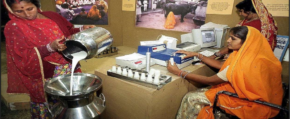
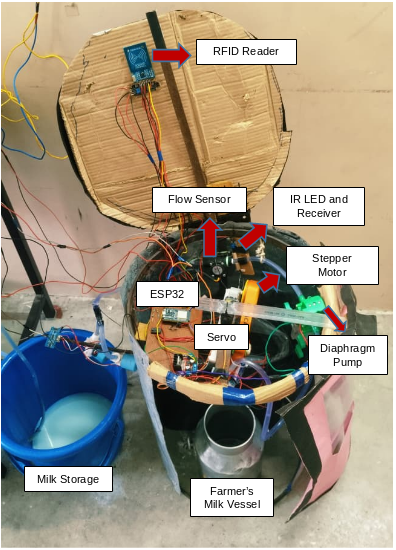
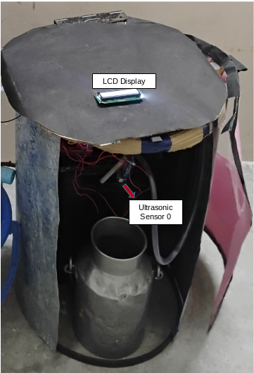
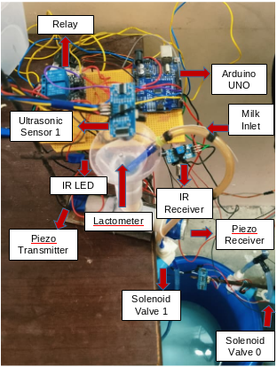

# Milk Procurement
In rural areas, most milk procurement from dairy farmers is done through dairy cooperative societies, e.g., TCMPFL (Tamil Nadu Cooperative Milk Producers' Federation Limited).

In India, there are more than 2 lakh dairy cooperative societies, and the total procurement by these societies is up to 60,000 tonnes of milk.

During procurement, a person usually a dairy industry staff member must be present at the milk booth for the process to take place. This creates a dependency on dairy industry staff.

# Automatic Milk Procurement System
This system enables farmers to deposit milk without the intervention of dairy industry staff.

## Prototype

#### Milk Analyzer

## Working Video 
<video src="https://drive.google.com/file/d/17zVuWN01ucVUGDLbvMpi7Bafa3PvSYsn/view?usp=sharing"></video>
